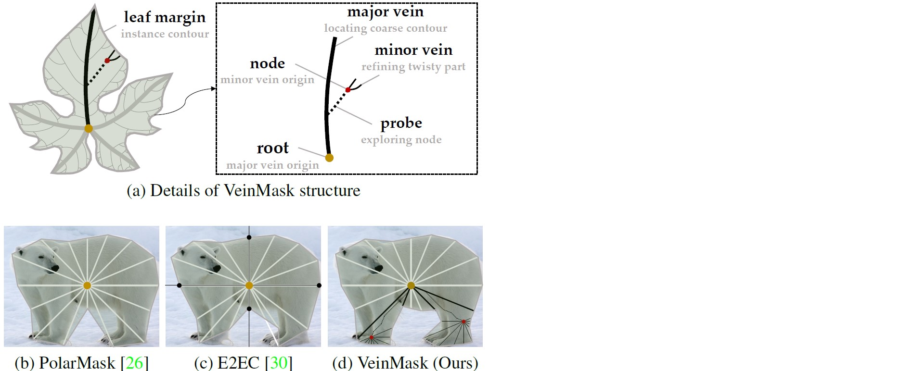

# VeinMask: Growing Instance Mask on Leaf

The code for implementing the VeinMask. 


## News
- The code for VeinMask is released.(2022.11.13)


## Visualization of our motivation



## Installation
Our VeinMask is based on [mmdetection](https://github.com/open-mmlab/mmdetection).


### Set up the python environment
```
conda create -n veinmask python=3.6.8
conda activate veinmask

# install pytorch, the cuda version is 10.2
# You can also install other versions of cuda and pytorch, but please make sure # that the pytorch cuda is consistent with the system cuda

conda install pytorch==1.9.0 torchvision==0.10.0 torchaudio==0.9.0 cudatoolkit=10.2 -c pytorch

pip install cython pycocotools shapely Polygon3 imagecorruptions mmcv==1.5.0
```

### Compile cuda extensions
```
python setup.py develop
```


## Training
### Training on SBD
##### 4gpu train
```
#ResNet-50
python -m torch.distributed.launch --nproc_per_node=4 tools/train.py configs/vein_sbd_r50.py --launcher pytorch
```

### Training on COCO
##### 4gpu train
```
#ResNet-50
python -m torch.distributed.launch --nproc_per_node=4 tools/train.py configs/vein_coco_r50.py --launcher pytorch

#ResNet-101
python -m torch.distributed.launch --nproc_per_node=4 tools/train.py configs/vein_coco_r101.py --launcher pytorch
```

## Contributing to the project
Any pull requests or issues are welcome.

## Acknowledgement
Code is largely based on [PolarMask](https://github.com/xieenze/PolarMask). Thanks for their wonderful works.

## License

For academic use, this project is licensed under the 2-clause BSD License - see the LICENSE file for details. For commercial use, please contact the authors. 
